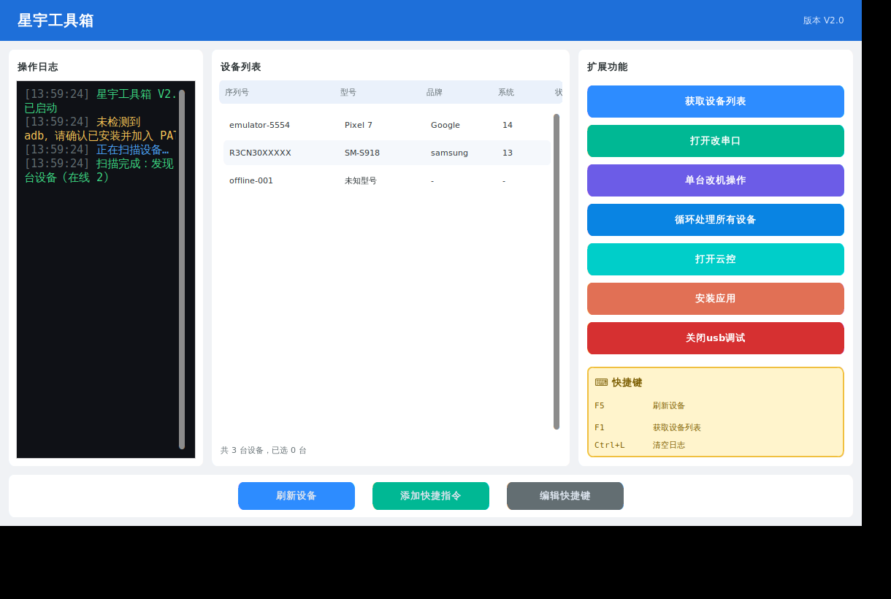

# 星宇工具箱 V2.0

基于 **customtkinter** 构建的现代扁平风格桌面工具，面向 **Android 设备管理** 与 **USB 串口通信**。
界面采用三栏布局：左侧彩色操作日志、中间设备列表、右侧扩展功能区，底部为常用操作栏。



## 功能特性

| 区域 | 功能 |
| --- | --- |
| 顶部标题栏 | 蓝色标题「星宇工具箱」+ 版本号 V2.0 |
| 操作日志 | 黑底彩色日志：信息(蓝) / 成功(绿) / 警告(黄) / 错误(红)，带时间戳 |
| 设备列表 | adb 扫描设备，展示序列号/型号/品牌/系统/状态，支持多选 |
| 获取设备列表 | 通过 `adb devices -l` 扫描并补全设备属性 |
| 打开改串口 | 串口控制台：扫描端口、设置波特率、收发数据（支持 HEX），实时显示 |
| 单台改机操作 | 高级设备操作：自定义 ADB/Shell 命令 + 常用属性修改（设备名、setprop） |
| 循环处理所有设备 | 对所有在线设备批量执行快捷指令 |
| 打开云控 | 预留扩展框架（投屏 / 远程控制 / 任务下发） |
| 安装应用 | 选择 APK 并在选中设备上执行 `adb install -r` |
| 关闭 usb 调试 | 对选中设备尝试关闭 USB 调试 |
| 底部栏 | 刷新设备、添加快捷指令、编辑快捷键 |
| 快捷键区 | 右下角黄色区域展示快捷键，支持编辑持久化 |

## 项目结构

```
star_toolbox/
├── main.py                     # 程序入口
├── requirements.txt
├── config.json                 # 运行时生成的配置（已 gitignore）
└── app/
    ├── theme.py                # 配色与字体（集中管理视觉风格）
    ├── core/
    │   ├── adb_manager.py      # ADB 设备扫描/属性/命令/安装封装
    │   ├── serial_manager.py   # pyserial 串口封装（后台读取线程）
    │   └── config_manager.py   # JSON 配置持久化
    └── ui/
        ├── main_window.py      # 主窗口，组装布局并连接业务逻辑
        ├── log_panel.py        # 左侧彩色日志面板
        ├── device_panel.py     # 中间设备列表
        ├── action_panel.py     # 右侧 7 个功能按钮 + 快捷键区
        ├── footer.py           # 底部三个按钮
        └── dialogs.py          # 串口/高级操作/快捷指令/快捷键 弹窗
```

## 环境要求

- Python 3.9+
- 依赖：`customtkinter`、`pyserial`
- 设备相关功能需安装 **adb** 并加入 PATH（[Android Platform Tools](https://developer.android.com/tools/releases/platform-tools)）

## 安装与运行

```bash
pip install -r requirements.txt
python main.py
```

> 缺少 adb 时界面仍可正常打开，相关按钮会在日志区给出提示；
> 缺少 pyserial 时串口功能会被禁用并提示安装。

## 设计要点

- **线程隔离**：所有耗时操作（设备扫描、命令执行、安装、串口读取）均在后台线程进行，
  通过 `after()` 切回主线程更新 UI，界面不卡顿。
- **模块化**：UI 与业务逻辑分离，`core` 层不依赖任何界面代码，便于测试与复用。
- **可扩展**：循环处理 / 云控等按钮已搭好框架与日志反馈，后续可直接接入实现。
- **配置持久化**：串口参数、快捷指令、快捷键说明保存在 `config.json`，启动自动加载。

## 快捷键

| 快捷键 | 功能 |
| --- | --- |
| F5 / F1 | 刷新 / 获取设备列表 |
| Ctrl+L | 清空日志 |

可通过底部「编辑快捷键」修改展示内容。
